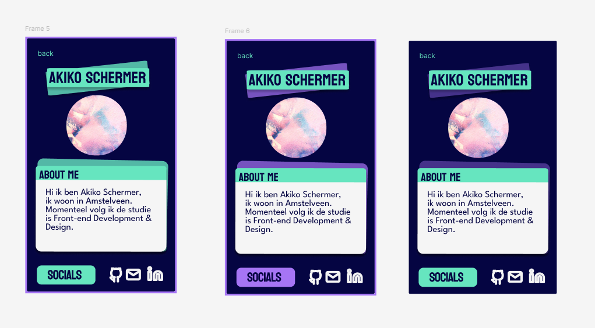
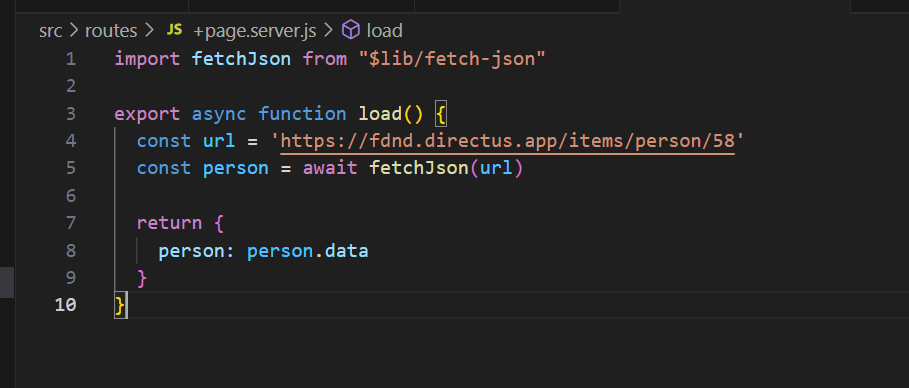

# week 1

## Team Canvas
Met alle team leden heb ik een teamcanvas gemaakt. We hebben hier een aantal afspraken en doelen op geschreven. Ook de manier van communicatie, bij ons is het teams.


## Projectboard 

Op github hebben wij een projectboard aangemaakt en daarin alvast een paar taken (issues) in gezet.
  

---
## Designs
Ieder teamlid heefd een design gemaakt 


---
### Code 

#### Squad page: 

Voor sveltekit maak je de routes aan door een map te maken. Voor de squad page hebben we routes aangemaakt met de namen van de teamleden, zodat iedereen individueel de home page kan bouwen. 

routes 


```html
<article>
    <a href="Rukiya">
        
    </a>       
</article>
```

```html
  display: inline-block; 
```
## week 2

Met groep hebben we afgesproken om een design te maken voor de detail pagina. 
 


Ik heb na de figma workshop een beetje geoefend door een card-component te maken met mijn mushot. Daarna heb een design gemaakt van onze detail pagina.  

Met inspiratie van mijn design hebben de andere team leden ook een eigen versie gemaakt. Uiteindelijk hebben wij gezamelijk een "final verion" designed door componenten van elk design samen te voegen. 

Final design


leervraag:  Hoe zorg ik er voor dat alles wat ik doe goed bij hou? Wat zijn de manieren om mijn documentatie goed te weergeven? 

## week 3

### projectboard
In de laatste week hebben we tasks gemaakt die wat meer detial hebben en ook kleiner zijn zodat de teamleden makkelijk een taak kunnen op pakken.   


### Profile card 

Design:

Ik heb er voor gekozen om mijn design erg simpel te houden. Ik wil graag mijn naam in een grote font. Ik heb een paar achtergrond kleuren uitgeprobeerd(week2). Uiteindelijk heb ik een nieuw design gemaakt en heb ik toch er voor gekozen om het wit te houden, met een grote font. 


### Code




Tijdens 


ReadMe toegevoegd 

Leervraag:  Hoe gebruik je JavaScript op sveltekit client side 