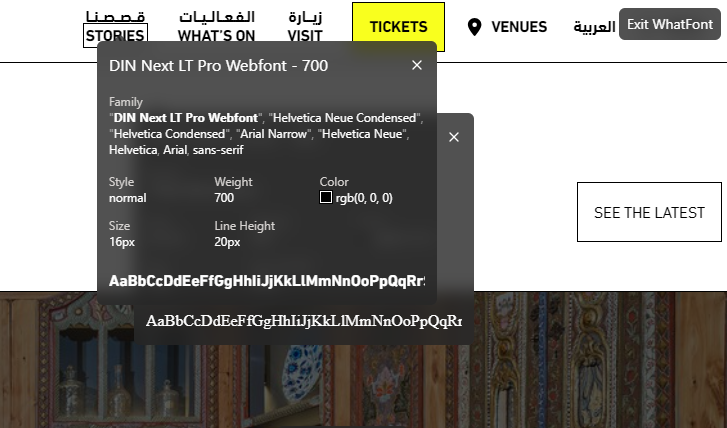

### Sprint 14

## Projectboard

## Problems

Error: 
" Failed to load resource: the server responded with a status of 403 " 



## Schetsen 
.jpeg>)
.jpeg>)
.jpeg>)
.jpeg>)

# notes 
## week 1
jamstack:  site genarater with headless CMS

preferred stack : sveltekit & Directus 

Fabrique 

contanctpersoon :  Marko kruijer 

Briefing:

- stategisch design agency
- komen uit t u delft
- part pf eidra(consultacy vreatifity )
- het is een echt project waar ze dit jaar mee zijn begonnen
- is geen 1 museum collectie van  4 musea en een aantal gallerijen
- infinite canvas
- hover grijze knoppen: met hover worden de anderen gedimd.
- SEO vriendelijk,  screen reader moet het kunnen uit lezen/  toegankelijk / multilangual
- Zoomable 200% in 50% out
- pannable (links rechts omhoog omlaag )
- website platfotm, collectie platform. de nav komt van de website-platform.
- Het uitgrijsen is niet voor mobile
- 

Epic 

stories 

user stories 

Als bezoeker wil  ik oneindig lang kunnen scrollen in alle richtingen 

Als bezoeker wil ik kunnen s

vrijdag onderzoek doen voor infinite canvas

## Week 2: 

We love web 

started dev in 2012 

- Creative developer
    - fancy term for dev with an eye for creativity
    - websites, apps
    - animations
- he uses motion to help the usre focus on a specific section
- lief Amsterdam website : [Lief](https://liefamsterdam.nl/?source=g&device=c&campaignid=19018830878&adgroupid=146600582609&gad_source=1&gclid=Cj0KCQjwpP63BhDYARIsAOQkATZlNCVlkKJmK-ADf7oxZNO3t5QhwpqPeAlAkNlWAnUECDZCS1Q2_YwaAsewEALw_wcB)
- LOER

If you make somthing move its an eye catcher 

conlusion

- think of animations and interaction as an extension to an original intent
- be open minded ask yourself what it brings and ask ofr feedback
- be ready to spend a lot of time on it

issues van justus:

voeg een header toe , main om de slot, en een footer toevoegen.

export let name ,  >> import filename from $lib/file name 

export {default as filename}  from .file route

data hiding 

structuur in svelt is anders denk aan minder 

reading mode

page sever.js meot aangepast worden om infinit scroll te krijegen 

Scroll snap :

```jsx
scroll-snap-type: both mandatory; /* Enable both horizontal and vertical snapping **/
scroll-behavior: smooth; /**Smooth scrolling */
```

### Week 3: 

systematisch werken 

specificaties(documenten):

 hele uitgebreide project documentatie

continuous intergration:  geautomatiseerde deployment van je website. een manier van koppelen van code aan je life site.  

Geleerd: 

We hebben er voor gekozen dat we masonary gebruiken, ik wist niet wat voor soort canvas het zou zijn dus ik heb het op het internet gezocht 

## What is Masonry?

Masonry is a JavaScript grid layout library. It works by placing elements in optimal position based on available vertical space, sort of like a mason fitting stones in a wall.

Hadira heeft het canvas gemaakt, ik heb haar code een bekeken om te kijken of er een paar element en worden gebruikt 

ze gebruikt voor de afbeeldingen figure

The **`<figcaption>`** [HTML](https://developer.mozilla.org/en-US/docs/Web/HTML) element represents a caption or legend describing the rest of the contents of its parent [`<figure>`](https://developer.mozilla.org/en-US/docs/Web/HTML/Element/figure) element, providing the `<figure>` an [accessible description](https://developer.mozilla.org/en-US/docs/Glossary/Accessible_description).

ik heb aan schat gpt gevraag om comments te zetten bij elke line met een  kleine uitleg. om te begrijpen hoe fe masonry in elkaar zit en er uit gaat zien

```css
.masonry {
    column-count: 1;           /* Sets the number of columns for the masonry layout (1 column on smaller screens) */
    column-gap: 1rem;          /* Defines the gap between columns */
    list-style: none;          /* Removes the default list styling (like bullets or numbers) */
    padding: 0;                /* Removes the default padding of the list */
}

.masonry-item {
    break-inside: avoid;       /* Prevents the item from breaking across columns */
    margin-bottom: 1rem;       /* Adds space between each masonry item */
    position: relative;        /* Allows positioning of child elements relative to this container */
    overflow: hidden;          /* Hides any overflow content (useful for image scaling) */
    background-color: #fff;    /* Sets a white background for each masonry item */
    border-radius: 8px;        /* Rounds the corners of each masonry item */
    box-shadow: 0 4px 6px rgba(0, 0, 0, 0.1); /* Adds a subtle shadow for a 3D effect */
}

figure {
    margin: 0;                 /* Removes the default margin from the figure element */
    position: relative;        /* Allows positioning child elements inside the figure relative to this */
}

img {
    width: 100%;               /* Makes the image take the full width of its container */
    height: auto;              /* Keeps the aspect ratio of the image */
    display: block;            /* Ensures the image is displayed as a block element (removes whitespace) */
    border-radius: 8px;        /* Rounds the corners of the image */
    transition: transform 0.3s ease-in-out; /* Smooth animation for image scaling on hover or interaction */
}

```

# :not()

The **`:not()`** [CSS](https://developer.mozilla.org/en-US/docs/Web/CSS) [pseudo-class](https://developer.mozilla.org/en-US/docs/Web/CSS/Pseudo-classes) represents elements that do not match a list of selectors. Since it prevents specific items from being selected, it is known as the *negation pseudo-class*.

Database is best incompleet! 

```js

        <!-- Repeat the items for infinite scroll effect -->
        {#each data.artObjects as art, i (art.id)}<!-- Doorloop de data.artObjects array en render elk item -->
        <!-- Voor elk art object wordt de bijbehorende HTML gegenereerd.
            i is de index van het huidige element in de lus.
            (art.id) zorgt ervoor dat elk item een unieke sleutel heeft, wat Svelte helpt om efficiënt te renderen. -->
            <li class="masonry-item">
                <figure>
                    
                    <figcaption>
                        <h2>{art.title}</h2>
                        <a href="#" class="button">Meer info</a>
                    </figcaption>
                </figure>
            </li>
        {/each}
```

feedback 

document outline 

Hoe gaan jullie om met imposter syndroom? 

Test de hover van de images voor een mobile versie,  misschien is het goed om op mobiel de afbeeldingen wel al een titel te geven. 

h2 in een list is niet handig voor een screen reader, een lijst is geen section element. het is overkill, figcaption heeft all een semantiche waarden. 

Geef de gallary een hea

3.4.1 opdracht gever briefing, het gee wat je hebt afgesproken voldoet aan wat je hebt gemaakt 

3.4.2 figma designs breakdown-schets data-model

3.4.3 alle tools die je hebt gebruikt en geimplementeerd 

3.3.3, pull request issues project board, readme (documentatie) standups 

3.5.1 frontend focus, css ontwikkelingen , smashing magazine, masterdom, performance now medium slack channels, reddit. 

3.5.2  Aankomende sprint

3.5.3 waar op de lijn bevind jij op de lijn, hoe sta je in je studie ? 

3.1.2

3.1.3 Testen en test resultaten verwerken.

tip : laat je bewijslast door iemand anders te lezen, als je niet zeker weet of het goede bewijslast is. 

Kampvuursessie  : 

hoe ging de samenwerking? 

Wat ging er goed?  

De taken verdeling ging goed,  ookal waren het kleine taken.  

Duidelijke afspraken gemaakt iedereen hield zich goed aan de taken. Communiceren ging ook heel er goed
